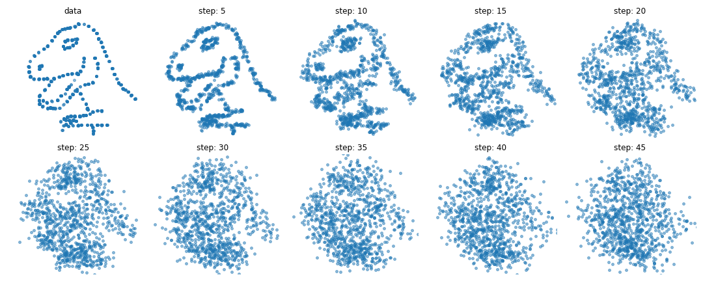
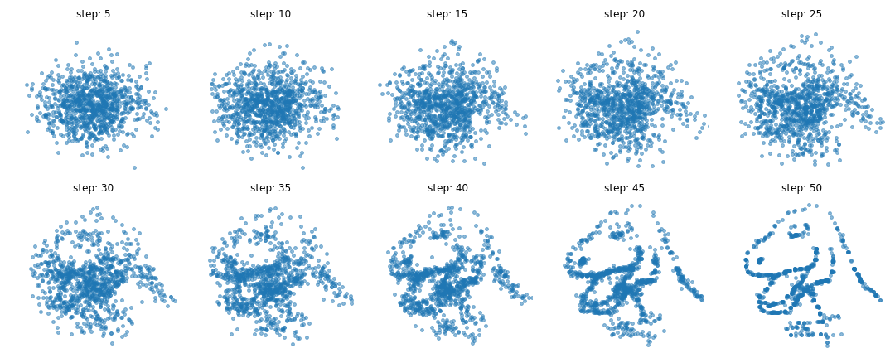
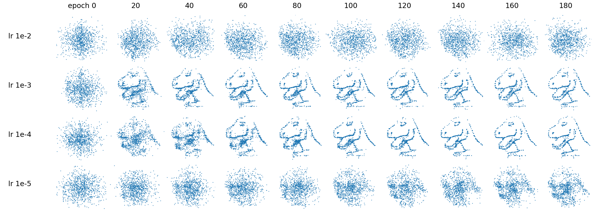
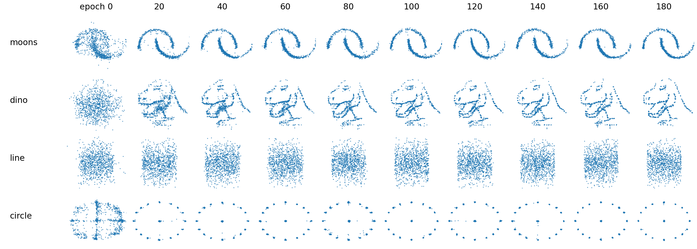
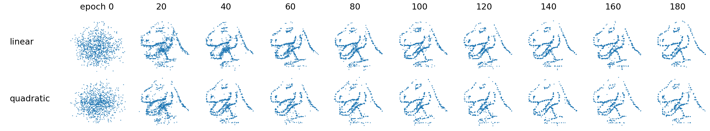
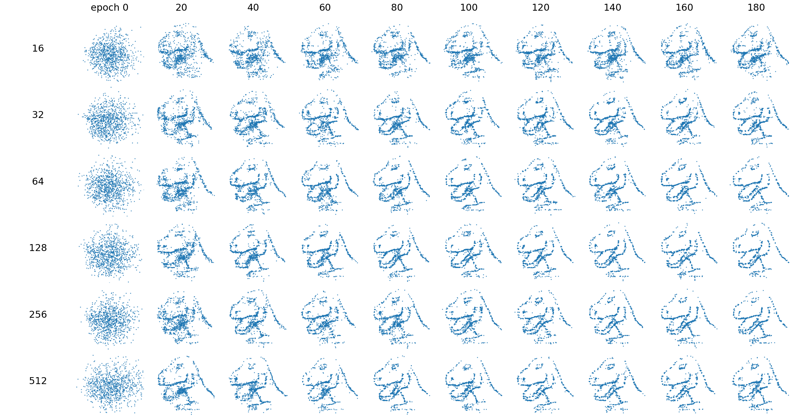
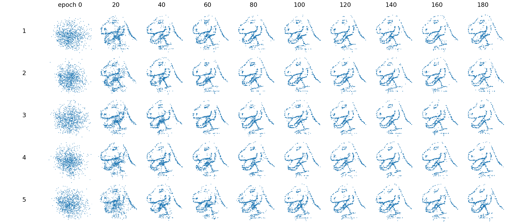
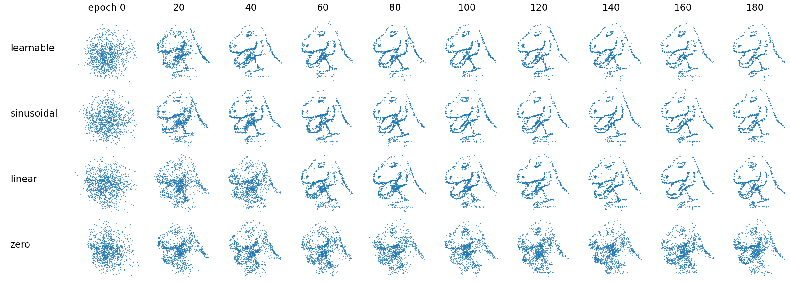
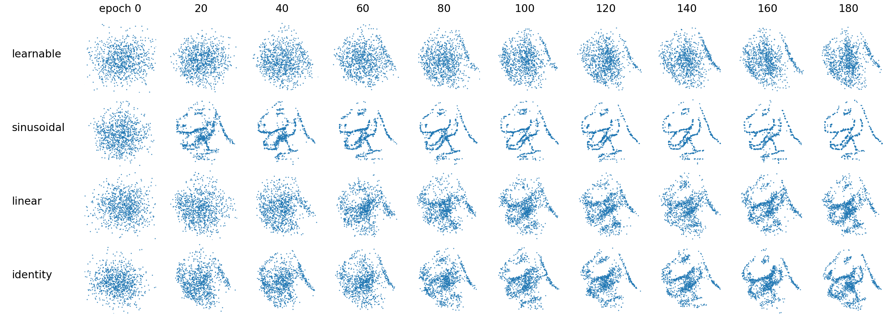

# tiny-diffusion

A minimal PyTorch implementation of probabilistic diffusion models for 2D datasets. Get started by running `python ddpm.py -h` to explore the available options for training.

## Forward process

A visualization of the forward diffusion process being applied to a dataset of one thousand 2D points. Note that the dinosaur is not a single training example, it represents each 2D point in the dataset.

## Reverse process

This illustration shows how the reverse process recovers the distribution of the training data.

## Ablations

I have run a series of ablations experiments on hyperparameters, such as learning rate and model size, and visualized the learning process. The columns in the graphs represent the checkpoint epoch, and the rows indicate the hyperparameter values. Each cell displays one thousand generated 2D points.

### learning rate

The learning process is sensitive to the learning rate. At first, the model's output was poor, causing me to suspect a bug. However, simply changing the learning rate value resolved the problem.

### dataset

The current model configuration doesn't work well on the `line` dataset, which I consider the most basic among them. The corners should be clear and sharp, but they are fuzzy.

### num timesteps

A longer diffusion process results in a better output. With fewer timesteps, the dinosaur is incomplete, missing points from the top and bottom.

### variance schedule

The quadratic schedule does not yield better results. Other schedules like cosine or sigmoid should also be considered.

### hidden size

The capacity of the model doesn't seem to be a bottleneck, as similar results are obtained across various hidden layer sizes.

### number of hidden layers

As in the hidden size ablation run, the capacity of the model does not seem to be a limiting factor.

### positional embedding (timestep)

The model benefits from the timestep information, but the specific method of encoding the timestep is not important.

### positional embedding (inputs)

The use of sinusoidal embeddings for the inputs helps with learning high-frequency functions in low-dimensional problem domains, such as mapping each (x, y) pixel coordinate to (r, g, b) color, as demonstrated in [this study](https://bmild.github.io/fourfeat/). The same holds true in the current scenario.

## References

* The dino dataset comes from the [Datasaurus Dozen](https://www.autodesk.com/research/publications/same-stats-different-graphs) data.
* HuggingFace's [diffusers](https://github.com/huggingface/diffusers) library.
* lucidrains' [DDPM implementation in PyTorch](https://github.com/lucidrains/denoising-diffusion-pytorch).
* Jonathan Ho's [implementation of DDPM](https://github.com/hojonathanho/diffusion).
* InFoCusp's [DDPM implementation in tf](https://github.com/InFoCusp/diffusion_models).

